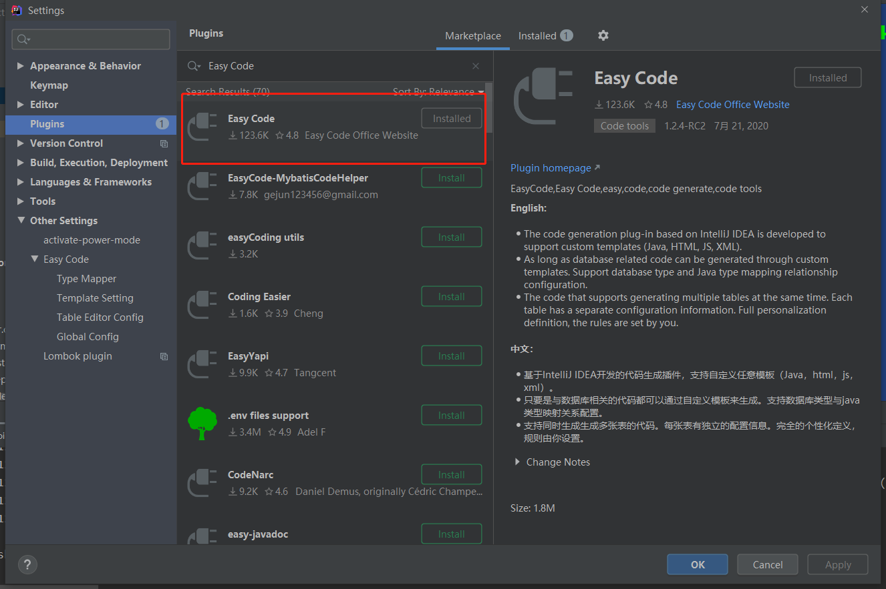
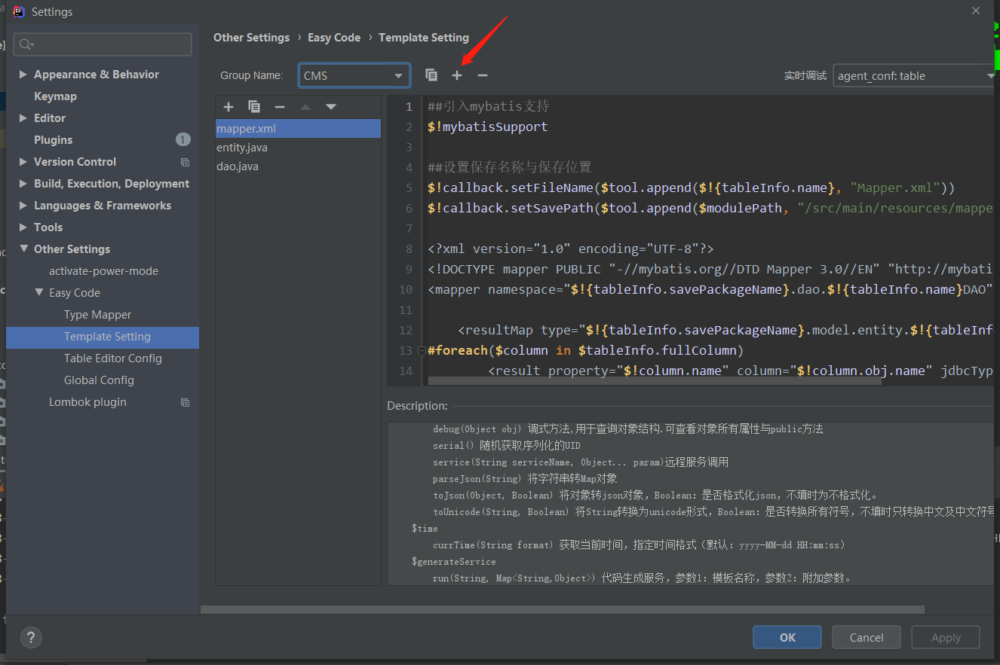
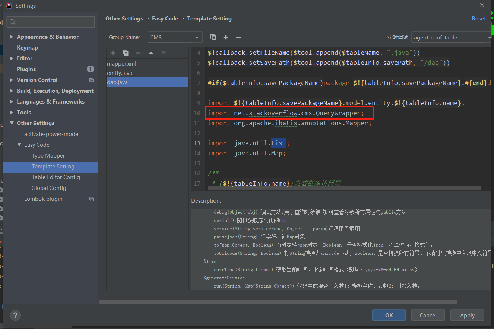
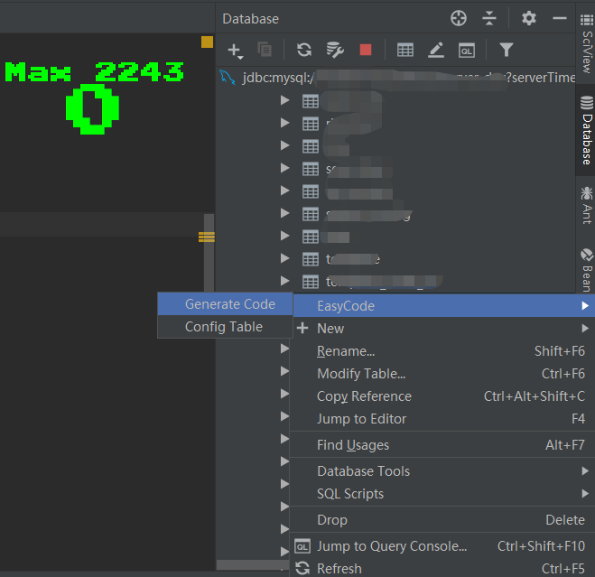
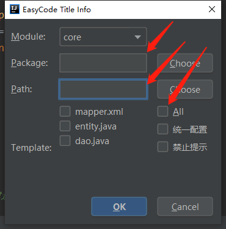

# IDEA插件Easy Code模板

## 一、环境准备
### 1.1 安装IDEA
步骤略
### 1.2 安装Easy Code插件
* 打开`File->Settings->Plugins`，搜索`Easy Code`
* 点击`install`即可
* 如下图所示


## 二、导入模板文件
### 2.1 新建模板
* 打开`File->Settings->Other Settings->Easy Code->Template Setting`
* 点击`+`号，新建`Group Name`，名称随便

* 将工程中`template`目录下的模板文件依此添加到`Group Name`下的模板文件当中
* 将工程中`code`目录下的工具代码放置到自己的项目里，注意此步骤需要同步修改模板文件`DAO.java`中`QueryWrapper`类的包名


## 三、如何使用
### 3.1 通过`IDEA`的`Database`工具配置数据库连接
步骤略

### 3.2 生成代码
* 在`database`工具中找到需要生成代码的表，右键`EasyCode->Generate Code`

* 选择`Package`和`Path`，勾选`All`，点击`OK`即可


## 四、用例
### 4.1 条件查询
```
// new一个建造着对象
QueryWrapperBuilder builder = new QueryWrapperBuilder();
// age = 23
builder.eq("age", "23");
// name like "%李%" or note like "%李%"
builder.like("李", Arrays.asList("name", "note"));
// order by age asc,name desc
builder.asc("age");
builder.desc("name");
// limit 0, 10
builder.page(0,10);
QueryWrapper wrapper = builder.build();
List<User> user = userDAO.selectByCondition(wrapper);
// 查询总数，page分页参数limit 0, 10将无效
Integer total = userDAO.countByCondition(wrapper);
```
以上代码等同于  
`select * from user where age = 23 and (name like "%李%" or note like "%李%") order by age asc, name desc limit 0, 10`